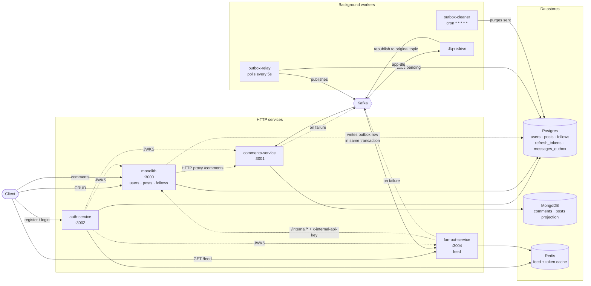
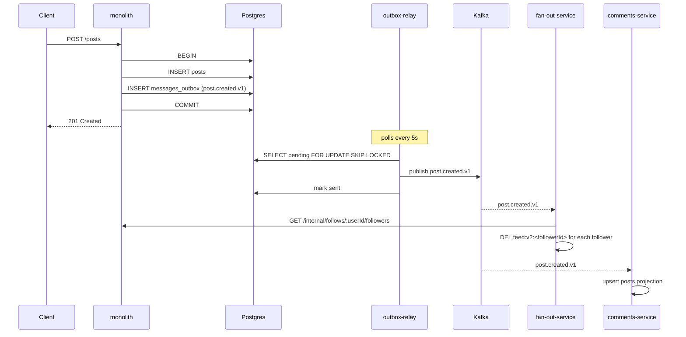

# news-feed

A backend for a "news feed" style social system: users, posts, follows, comments and a personalised feed.

It is an **npm-workspaces monorepo** of four TypeScript/Express services plus three background workers. Writes go through a **transactional outbox** into Kafka; downstream services consume those events to maintain projections and invalidate cached feeds, with a **dead-letter queue and redrive worker** for poison messages. Authentication is stateless **RS256 JWT + JWKS**, verified at the edge of every service with a Redis cache. The whole thing is instrumented end to end with the **LGTM stack** (Loki, Grafana, Tempo, Mimir) via a single Alloy collector.

---

## System design



### Write path — how a post reaches followers' feeds



The post row and its outbox row commit together, so an event can never be lost by a crash between the write and the publish — at the cost of at-least-once delivery, which consumers absorb by being idempotent.

### Read path — the feed

`GET /feed` is a **pull model**, not a precomputed per-user timeline:

1. **First page** is served from Redis (`feed:v2:<userId>`, TTL 300s). On a hit, the request never touches the monolith.
2. **On a miss** the fan-out service asks the monolith over `/internal/*` for the user's followees, their most recent posts (page size 10), and the author profiles, assembles the page, and caches it.
3. **Subsequent pages** (`?cursor=…`) always go straight to the monolith — only page one is worth caching.
4. **Invalidation** is event-driven: `post.created`, `post.deleted`, `follow.changed` and `user.deleted` each delete the affected users' cache keys.
5. **Redis down** is not fatal — reads fall through to the monolith and cache writes are skipped.

---

## Tech stack

| Area                  | Choice                                                          | Where                                                  |
| --------------------- | --------------------------------------------------------------- | ------------------------------------------------------ |
| Language / runtime    | TypeScript 6, Node.js (ESM), npm workspaces                     | `tsconfig.base.json`, root `package.json`              |
| HTTP                  | Express 5, helmet, cors, compression                            | `src/app.ts` per service                               |
| Validation            | Zod 4 — request bodies _and_ env vars                           | `src/middleware/validate.ts`, `src/config/env.ts`      |
| Relational data       | Postgres 15, `pg`, `node-pg-migrate`                            | `services/monolith/src/db/postgres`                    |
| Document data         | MongoDB 6, Mongoose                                             | `services/comments-service/src/db/mongo`               |
| Cache                 | Redis 7 (`redis`)                                               | fan-out feed cache, auth token cache                   |
| Messaging             | Kafka (`kafkajs`) + DLQ                                         | `src/kafka/*`, `services/shared/contracts`             |
| Auth                  | `jose` (RS256 + JWKS), `bcrypt`                                 | `services/auth-service`, `services/shared/auth-client` |
| Files                 | `multer` + `sharp` + AWS S3                                     | `services/monolith/src/lib/s3.ts`                      |
| Scheduling            | `node-cron`                                                     | `services/monolith/workers/outbox-cleaner.ts`          |
| Logging               | `pino` + `pino-http`, JSON with correlation ids                 | `src/lib/logger.ts`                                    |
| Metrics               | `prom-client` → `/metrics`                                      | `src/lib/metrics.ts`                                   |
| Tracing               | OpenTelemetry SDK + auto-instrumentation → OTLP                 | `src/lib/tracing.ts`                                   |
| Observability backend | Grafana Alloy → Loki / Mimir / Tempo → Grafana                  | `docker-compose.observability.yml`, `infra/`           |
| Testing               | Vitest (unit + integration projects), Supertest, Testcontainers | `vitest.config.ts` per service                         |
| Quality               | ESLint 10 (type-checked), Prettier                              | `eslint.config.js`, `.prettierrc.json`                 |

---

## Repository structure

```
.
├── docker-compose.yml                 # Kafka, Postgres, MongoDB, Redis + prometheus exporters
├── docker-compose.observability.yml   # Loki, Mimir, Tempo, Grafana, Alloy
├── eslint.config.js                   # flat config, type-checked, all workspaces
├── tsconfig.json                      # solution file — project references
├── tsconfig.base.json                 # shared compiler options
├── infra/                             # config for the observability stack
│   ├── alloy/config.alloy             # log tailing + metrics scraping + OTLP receiver
│   ├── grafana/provisioning/          # auto-provisioned datasources and dashboards
│   ├── loki/  mimir/  tempo/          # backend configs
├── logs/                              # services tee here; Alloy tails these files
└── services/
    ├── monolith/                      # :3000 — users, posts, follows, /internal, comments proxy
    │   ├── src/
    │   └── workers/                   # outbox-relay, outbox-cleaner, dlq-redrive
    ├── auth-service/                  # :3002 — register/login/refresh, JWKS endpoint
    ├── comments-service/              # :3001 — comments + posts projection (Mongo)
    ├── fan-out-service/               # :3004 — feed read API + cache invalidation consumer
    └── shared/
        ├── contracts/                 # Kafka topic names, event schemas, cursor codec
        ├── auth-client/               # JWT verify middleware + Redis token cache
        └── runtime/                   # BackgroundSupervisor, backoff, sleep
```

Every service follows the same internal layout:

```
src/
├── app.ts                 # Express wiring: middleware order, public vs protected routes
├── index.ts               # bootstrap, BackgroundSupervisor, graceful shutdown
├── config/                # env.ts (zod-validated), kafka.ts
├── db/                    # connection pools + health checks (+ migrations in monolith)
├── kafka/                 # producer / consumer wrappers (+ admin in monolith)
├── lib/                   # logger, metrics, tracing, errors, retry, async-handler
├── middleware/            # context (correlation id), validate, metrics, error-handler
├── modules/<domain>/      # routes → controller → service → repository (+ schemas, types)
└── routes/                # health, metrics
```

Business logic lives in `*.service.ts` and never touches Express; controllers only translate HTTP ↔ domain. Repositories are the only place SQL/Mongo queries appear.

---

## Services and ports

| Process          | Port                  | Datastore       | Kafka role                                       | Start with                      |
| ---------------- | --------------------- | --------------- | ------------------------------------------------ | ------------------------------- |
| monolith         | 3000                  | Postgres        | produces (via outbox)                            | `npm run dev:monolith`          |
| comments-service | 3001                  | MongoDB         | consumes `post.created/deleted`, produces to DLQ | `npm run dev:comments`          |
| auth-service     | 3002                  | Postgres, Redis | —                                                | `npm run dev:auth`              |
| fan-out-service  | 3004                  | Redis           | consumes all 4 domain topics, produces to DLQ    | `npm run dev:fan-out`           |
| outbox-relay     | 3010 _(metrics only)_ | Postgres        | produces                                         | `npm run worker:outbox`         |
| dlq-redrive      | 3011 _(metrics only)_ | —               | consumes `app-dlq`, re-produces                  | `npm run worker:dlq-redrive`    |
| outbox-cleaner   | —                     | Postgres        | —                                                | `npm run worker:outbox-cleaner` |

Grafana takes `3003`, which is why the monolith is on `3000` and nothing uses `3003`.

---

## Getting started

### Prerequisites

- Node.js 22+ and npm 10+
- Docker + Docker Compose

**Add a hosts entry for Kafka.** The broker advertises itself as `kafka:9092`, so clients running on your host get redirected to that name regardless of the bootstrap address. Without this, every service will fail to connect:

```sh
echo "127.0.0.1 kafka" | sudo tee -a /etc/hosts
```

### 1. Install and configure

```sh
npm install

cp .env.example .env
cp services/monolith/.env.example         services/monolith/.env
cp services/auth-service/.env.example     services/auth-service/.env
cp services/comments-service/.env.example services/comments-service/.env
cp services/fan-out-service/.env.example  services/fan-out-service/.env
```

The defaults work out of the box for local development. `.env` files are gitignored; the `.env.example` files are the reference. Two values must be kept in sync across services:

- `INTERNAL_API_KEY` — identical in `monolith` and `fan-out-service`.
- `AUTH_AUDIENCE` — identical in `monolith`, `comments-service` and `fan-out-service`, and equal to auth-service's `JWT_AUDIENCE`. An access token carries one `aud` claim, so a per-service audience makes every request 401.

### 2. Start infrastructure

```sh
docker compose up -d          # Kafka + Zookeeper, Postgres, MongoDB, Redis, exporters
```

### 3. Run migrations

```sh
npm run migrate:postgres
```

Kafka topics do **not** need creating — the monolith's `KafkaAdmin` creates any missing topic on startup.

### 4. Run the services

Each in its own terminal (all of these `tee` into `logs/`, which is what Alloy tails):

```sh
npm run dev:auth        # must be up first — the others fetch its JWKS
npm run dev:monolith
npm run dev:comments
npm run dev:fan-out

npm run worker:outbox           # required for any event to reach Kafka
npm run worker:outbox-cleaner   # optional — purges sent outbox rows
npm run worker:dlq-redrive      # optional — replays app-dlq
```

Services boot even when Kafka or Redis are unavailable: `BackgroundSupervisor` retries those connections with exponential backoff in the background while HTTP stays up.

### 5. Smoke test

```sh
curl localhost:3000/readyz   # {"status":"ready"}
curl localhost:3002/readyz
curl localhost:3001/healthz
curl localhost:3004/healthz
```

### Production-ish run

```sh
npm run build            # tsc + tsc-alias, all workspaces
npm run start:monolith   # node dist/... with tracing preloaded
```

---

## Observability

Optional, but this is the part most worth looking at:

```sh
docker compose -f docker-compose.yml -f docker-compose.observability.yml up -d
```

| UI / API | URL                    | Notes                                      |
| -------- | ---------------------- | ------------------------------------------ |
| Grafana  | http://localhost:3003  | anonymous admin, no login                  |
| Alloy    | http://localhost:12345 | inspect scrape targets and pipeline health |
| Loki     | http://localhost:3100  | logs (LogQL)                               |
| Mimir    | http://localhost:9009  | metrics (PromQL)                           |
| Tempo    | http://localhost:3200  | traces (TraceQL)                           |

One Alloy binary handles all three signals: it tails `logs/*.log` into Loki, scrapes `/metrics` from the services and from the Kafka/Postgres/MongoDB exporters into Mimir, and receives OTLP spans on `4317`/`4318` into Tempo. Dashboards in `infra/grafana/provisioning/dashboards/` are provisioned automatically — traffic overviews, outbox health, business metrics, per-datastore dashboards and a log explorer.

Every service exposes:

| Endpoint       | Purpose                         |
| -------------- | ------------------------------- |
| `GET /healthz` | liveness — uptime and timestamp |
| `GET /readyz`  | readiness — pings the datastore |
| `GET /metrics` | Prometheus exposition           |

Traces propagate across the whole write path. A `correlation-id` is attached per request in `middleware/context.ts`, carried in log lines, forwarded on the comments proxy and the `/internal` client, and the trace id is persisted on the outbox row so the async leg links back to the originating HTTP request.

---

## API

`Auth: yes` means the route sits behind `authClient.middleware()` and needs `Authorization: Bearer <accessToken>`.

### auth-service — `http://localhost:3002`

| Method | Path                     | Auth | Body                                        | Response                                    |
| ------ | ------------------------ | ---- | ------------------------------------------- | ------------------------------------------- |
| `POST` | `/auth/register`         | no   | `{ email, password }` — password 8–32 chars | `201 { accessToken, refreshToken, userId }` |
| `POST` | `/auth/login`            | no   | `{ email, password }`                       | `200 { accessToken, refreshToken }`         |
| `POST` | `/auth/refresh`          | no   | `{ refreshToken }`                          | `200 { accessToken }`                       |
| `GET`  | `/.well-known/jwks.json` | no   | —                                           | public keys, `cache-control: 3600`          |

Access tokens live 5 minutes; refresh tokens 7 days (hashed into `refresh_tokens`).

### monolith — `http://localhost:3000`

| Method   | Path                | Auth | Body / params                                   | Response                                                                        |
| -------- | ------------------- | ---- | ----------------------------------------------- | ------------------------------------------------------------------------------- |
| `POST`   | `/users`            | yes  | `{ email }`                                     | `201` user                                                                      |
| `GET`    | `/users`            | yes  | —                                               | `200` user[]                                                                    |
| `GET`    | `/users/:id`        | yes  | uuid                                            | `200` user                                                                      |
| `PUT`    | `/users/:id`        | yes  | `{ name (3–30), email }`                        | `200` user                                                                      |
| `DELETE` | `/users/:id`        | yes  | uuid                                            | `204` — emits `user.deleted.v1`                                                 |
| `PUT`    | `/users/:id/avatar` | yes  | multipart, field `avatar`, png/jpeg/webp ≤ 1 MB | `200 { avatarUrl }`                                                             |
| `POST`   | `/posts`            | yes  | `{ userId, content (1–280) }`                   | `201` post — emits `post.created.v1`                                            |
| `GET`    | `/posts/:id`        | yes  | uuid                                            | `200` post                                                                      |
| `PUT`    | `/posts/:id`        | yes  | `{ userId, content }`                           | `200` post                                                                      |
| `DELETE` | `/posts/:id`        | yes  | uuid                                            | `204` — emits `post.deleted.v1`                                                 |
| `POST`   | `/follows`          | yes  | `{ followerId, followingId }`                   | `201` — emits `follow.changed.v1`                                               |
| `GET`    | `/follows/:id`      | yes  | uuid of the followee                            | `200` follower ids                                                              |
| `DELETE` | `/follows/:id`      | yes  | uuid                                            | `204` — emits `follow.changed.v1`                                               |
| `*`      | `/comments/*`       | yes  | —                                               | transparently proxied to comments-service (10s timeout, `504`/`502` on failure) |

**Internal routes** — service-to-service only, guarded by a timing-safe `x-internal-api-key` header instead of a JWT:

| Method | Path                                  | Body                                   | Response                   |
| ------ | ------------------------------------- | -------------------------------------- | -------------------------- |
| `GET`  | `/internal/follows/:userId/following` | —                                      | `string[]` of followee ids |
| `GET`  | `/internal/follows/:userId/followers` | —                                      | `string[]` of follower ids |
| `POST` | `/internal/posts/by-authors`          | `{ ids (≤500), limit (1–10), cursor }` | `{ posts, nextCursor }`    |
| `POST` | `/internal/users`                     | `{ ids }`                              | user[]                     |

### comments-service — `http://localhost:3001` (reach it through the monolith proxy)

| Method   | Path                | Auth | Body / query                                                       | Response                       |
| -------- | ------------------- | ---- | ------------------------------------------------------------------ | ------------------------------ |
| `POST`   | `/comments`         | yes  | `{ postId, author: { userId, name, avatarUrl }, content (1–280) }` | `201` comment                  |
| `GET`    | `/comments/:postId` | yes  | `?limit=10&cursor=`                                                | `200 { comments, nextCursor }` |
| `DELETE` | `/comments/:id`     | yes  | —                                                                  | `204`                          |

### fan-out-service — `http://localhost:3004`

| Method | Path    | Auth | Query      | Response                    |
| ------ | ------- | ---- | ---------- | --------------------------- |
| `GET`  | `/feed` | yes  | `?cursor=` | `200 { posts, nextCursor }` |

The user is taken from the JWT `sub`, not from a parameter. `nextCursor` is a base64 `{ createdAt, id }` pair (`encodePaginationCursor` in `@news-feed/contracts`) — pass it back verbatim; `null` means the end of the feed.

## Events and contracts

`services/shared/contracts/src/index.ts` is the single source of truth for topic names and event payloads — both producers and consumers import from it, so a schema change is a compile error rather than a runtime surprise.

| Topic               | Producer                    | Consumers         | Payload                                                               |
| ------------------- | --------------------------- | ----------------- | --------------------------------------------------------------------- |
| `post.created.v1`   | monolith (`posts.service`)  | fan-out, comments | `{ v, postId, userId, createdAt }`                                    |
| `post.deleted.v1`   | monolith (`posts.service`)  | fan-out, comments | `{ v, postId, userId, createdAt }`                                    |
| `follow.changed.v1` | monolith (`follow.service`) | fan-out           | `{ v, followerId, followingId, action: created\|deleted, createdAt }` |
| `user.deleted.v1`   | monolith (`users.service`)  | fan-out           | `{ v, userId, postIds[], followerIds[], createdAt }`                  |
| `app-dlq`           | comments, fan-out           | dlq-redrive       | original message + `x-original-topic`, `x-dlq-reason` headers         |

Reactions:

- **fan-out** deletes the affected `feed:v2:*` cache keys.
- **comments** maintains a posts projection in Mongo, and purges a post's comments when the post is deleted — it never calls the monolith to answer a read.

---

## Data model

**Postgres** (`services/monolith/src/db/postgres/migrations/`, shared by monolith and auth-service):

| Table             | Notable columns                                                                                          |
| ----------------- | -------------------------------------------------------------------------------------------------------- |
| `users`           | `id` uuid pk, `email` unique, `name`, `avatar_url`, `password_hash`                                      |
| `posts`           | `id` uuid pk, `user_id` → `users` on delete cascade, `content`, timestamps                               |
| `follows`         | `follower_id`, `following_id`, unique together                                                           |
| `refresh_tokens`  | `token_hash`, `expires_at`, `revoked_at`, `user_id` cascade                                              |
| `messages_outbox` | `topic`, `payload` jsonb, `status`, `retry_count`/`max_retries`, `correlation_id`, `trace_id`, `sent_at` |

**MongoDB** (comments-service): `comments` (`postId` indexed, embedded `author`, `content` ≤ 280, timestamps) and a posts projection keyed by post id with `userId` and a `deletedAt` tombstone.

**Redis**: `auth:<token>` → verified token context (TTL ≤ 60s, capped by token expiry); `feed:v2:<userId>` → cached first feed page (TTL 300s).

---

## Architecture notes

**Transactional outbox.** `posts`/`follows`/`users` writes and their event rows commit in one Postgres transaction (`withTransaction`). `outbox-relay` polls pending rows every 5s, publishes, and marks them sent; `outbox-cleaner` deletes sent rows every minute. Delivery is at-least-once, so consumers are written to be idempotent (upserts, `DEL` on cache keys).

**DLQ and redrive.** Consumers wrap each handler in `withRetry`; on exhaustion the message goes to `app-dlq` with the original topic and failure reason in headers. `dlq-redrive` republishes it to the original topic, so a fix-and-replay needs no manual Kafka surgery.

**Stateless auth.** auth-service holds the only private key and publishes its public half at `/.well-known/jwks.json`. Other services never call it per request: `@news-feed/auth-client` verifies signatures locally against the cached JWKS and memoises verified tokens in Redis for up to 60s. If Redis is down, verification still succeeds — only the cache is skipped.

**Cursor pagination.** Keyset, not offset: a cursor is a base64 `{ createdAt, id }`, and queries fetch `limit + 1` rows to decide whether a next page exists. Stable under concurrent inserts and index-friendly at depth.

**Booting with dependencies down.** `BackgroundSupervisor` (`@news-feed/runtime`) owns every long-lived connection (Kafka consumers/producers, Redis, Kafka admin). It retries with exponential backoff, tracks per-service status, and is drained during shutdown — so a service starts and serves `/healthz` even if Kafka is not up yet, and `SIGTERM` closes servers, consumers and pools in order.

**Correlation and tracing.** `middleware/context.ts` puts a correlation id (and, once authenticated, the user id) into `AsyncLocalStorage`; it is emitted on every log line, forwarded across the comments proxy and the `/internal` client, and stored on outbox rows alongside the trace id so a Grafana trace spans HTTP → Postgres → Kafka → consumer.

---

## Development

```sh
npm run typecheck        # tsc --noEmit across all workspaces
npm run lint             # eslint, type-checked rules
npm run format           # prettier --write
npm run build            # compile all workspaces to dist/
```

Tests are per workspace:

```sh
npm --workspace services/monolith run test:unit
npm --workspace services/monolith run test:integration   # needs Docker (Testcontainers)
npm --workspace services/monolith run test:coverage
npm --workspace services/auth-service run test:unit
```

Vitest is split into two projects. `unit` mocks repositories and runs in-process. `integration` spins up a real Postgres with Testcontainers, drives the app through Supertest, and runs serially in a forked pool (`maxWorkers: 1`) so tests share one container.

Migrations:

```sh
npm run migrate:postgres:create -- my-migration-name
npm run migrate:postgres
npm run migrate:postgres:down
```

---

## Environment variables

`.env` is loaded per service and validated by Zod at startup — a missing or malformed value fails the process immediately with a readable message rather than surfacing as an error later.

### monolith (`services/monolith/.env`)

| Variable                                          | Required                             | Default                                   | Purpose                                  |
| ------------------------------------------------- | ------------------------------------ | ----------------------------------------- | ---------------------------------------- |
| `PORT`                                            | no                                   | `3000`                                    | HTTP port                                |
| `OUTBOX_RELAY_PORT` / `DLQ_REDRIVE_PORT`          | no                                   | `3010` / `3011`                           | worker metrics ports                     |
| `NODE_ENV`                                        | no                                   | `development`                             |                                          |
| `SERVICE_NAME`                                    | no                                   | `news-feed-monolith`                      | metric/log label                         |
| `LOG_LEVEL`                                       | no                                   | `info`                                    | pino level                               |
| `LOG_HTTP_INFRA`                                  | no                                   | `false`                                   | also log health/metrics requests         |
| `COMMENTS_SVC_URL`                                | no                                   | `http://localhost:3001`                   | proxy upstream                           |
| `POSTGRES_DB_HOST/PORT/USER/PASSWORD/NAME`        | **yes** (host, user, password, name) | port `5432`                               | connection                               |
| `DATABASE_URL`                                    | **yes** for migrations               | —                                         | read by `node-pg-migrate`                |
| `REDIS_URL`                                       | no                                   | `redis://localhost:6379`                  | auth token cache                         |
| `AUTH_JWKS_URL` / `AUTH_ISSUER` / `AUTH_AUDIENCE` | no                                   | localhost:3002 / `auth-svc` / `news-feed` | JWT verification                         |
| `INTERNAL_API_KEY`                                | **yes**                              | —                                         | guards `/internal/*`; must match fan-out |
| `KAFKA_NEWS_FEED_SERVICE_CLIENT_ID`               | **yes**                              | —                                         | min 5 chars                              |
| `KAFKA_BROKERS`                                   | no                                   | `127.0.0.1:9092`                          | comma-separated                          |
| `AWS_REGION` / `AWS_BUCKET_NAME`                  | **yes**                              | —                                         | avatar uploads                           |
| `AWS_ACCESS_KEY_ID` / `AWS_SECRET_ACCESS_KEY`     | for uploads                          | —                                         | read by the AWS SDK                      |
| `OTEL_*`                                          | no                                   | —                                         | standard OpenTelemetry env vars          |

### auth-service (`services/auth-service/.env`)

| Variable                                            | Required | Default                  |
| --------------------------------------------------- | -------- | ------------------------ |
| `PORT`                                              | no       | `3002`                   |
| `SERVICE_NAME`                                      | no       | `auth-svc`               |
| `POSTGRES_DB_HOST/USER/PASSWORD/NAME`               | **yes**  | — (port `5432`)          |
| `REDIS_URL`                                         | no       | `redis://localhost:6379` |
| `JWT_ISSUER`                                        | no       | `auth-svc`               |
| `JWT_AUDIENCE`                                      | no       | `news-feed`              |
| `NODE_ENV`, `LOG_LEVEL`, `LOG_HTTP_INFRA`, `OTEL_*` | no       | as above                 |

### comments-service (`services/comments-service/.env`)

| Variable                                          | Required | Default                                   |
| ------------------------------------------------- | -------- | ----------------------------------------- |
| `PORT`                                            | no       | `3001`                                    |
| `SERVICE_NAME`                                    | no       | `comments-svc`                            |
| `MONGO_DB_HOST/USER/PASSWORD/NAME`                | **yes**  | — (port `27017`)                          |
| `REDIS_URL`                                       | no       | `redis://localhost:6379`                  |
| `AUTH_JWKS_URL` / `AUTH_ISSUER` / `AUTH_AUDIENCE` | no       | localhost:3002 / `auth-svc` / `news-feed` |
| `KAFKA_NEWS_FEED_SERVICE_CLIENT_ID`               | **yes**  | —                                         |
| `KAFKA_BROKERS`                                   | no       | `127.0.0.1:9092`                          |

### fan-out-service (`services/fan-out-service/.env`)

| Variable                            | Required | Default                   |
| ----------------------------------- | -------- | ------------------------- |
| `PORT`                              | no       | `3004`                    |
| `SERVICE_NAME`                      | no       | `fan-out-service`         |
| `REDIS_URL`                         | no       | `redis://localhost:6379`  |
| `AUTH_JWKS_URL` / `AUTH_ISSUER`     | **yes**  | —                         |
| `AUTH_AUDIENCE`                     | no       | `news-feed`               |
| `MONOLITH_URL`                      | **yes**  | —                         |
| `INTERNAL_API_KEY`                  | **yes**  | — must match the monolith |
| `KAFKA_NEWS_FEED_SERVICE_CLIENT_ID` | **yes**  | —                         |
| `KAFKA_BROKERS`                     | no       | `127.0.0.1:9092`          |
